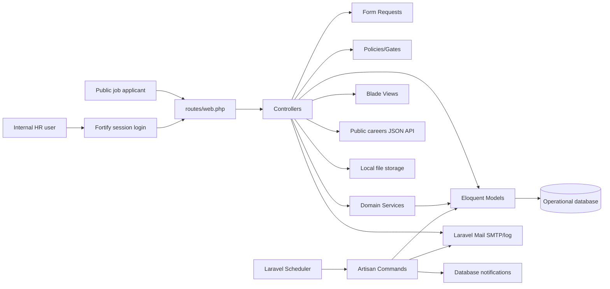
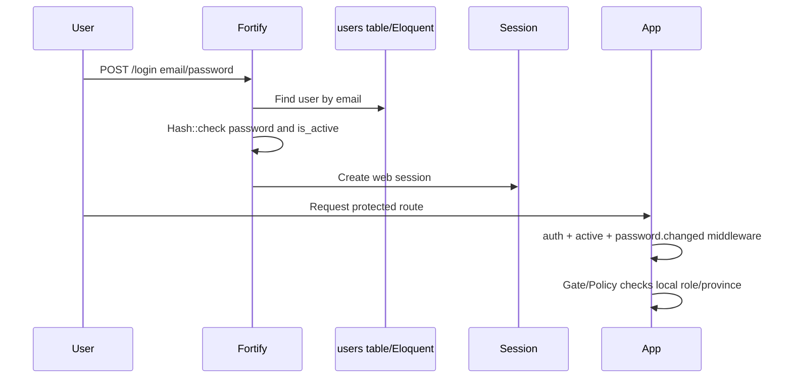
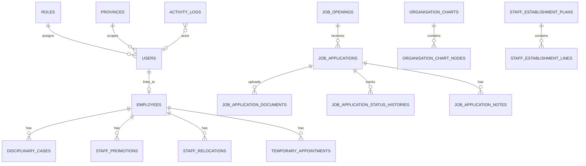

# RTCZ Common Enterprise Application Architecture Discovery

Read-only discovery date: 2026-09-14  
Repository inspected: `people-culture-records`

## 1. Executive Technical Summary

The inspected system is a Laravel-based People & Culture records management application covering employee records, disciplinary cases, promotions, relocations, temporary appointments, staff establishment, organisation charts, recruitment/job openings, public career applications, imports, reports/exports, notifications and audit logs.

Main users are internal Admin, HR Manager, HR Officer and Viewer roles, plus unauthenticated public job applicants using careers and application withdrawal pages. The stack is PHP 8.2, Laravel 12.58.0, Laravel Fortify, Blade, Bootstrap-style server-rendered UI, Vite/Tailwind asset tooling, Eloquent ORM, MySQL in the local environment, Laravel database sessions/cache/queues, SMTP/log mail, DomPDF and Maatwebsite Excel.

Architectural style is a modular Laravel monolith with controllers, form requests, policies, Eloquent models, Blade views, console commands and local database migrations. Principal integrations are email/SMTP, file storage, PDF/Excel generation, public JSON careers endpoints and scheduled Artisan commands. It is partly ready for enterprise integration because it already has clear domain tables, local RBAC, public careers APIs, audit logs and scheduled jobs. Main enterprise gaps are lack of Microsoft organizational SSO, lack of service-account/API authentication, no API versioning/OpenAPI, no event bus, limited integration contracts and no confirmed production monitoring/backup architecture.

## 2. Repository and Solution Structure

| Area | Confirmed structure | Evidence |
|---|---|---|
| Solution root | Single Laravel application, not a multi-project solution | `composer.json`, `artisan`, `bootstrap/app.php` |
| Backend/application code | PHP application under `app/` | `app/Http/Controllers`, `app/Models`, `app/Services` |
| Frontend | Server-rendered Blade views with Vite-built CSS/JS | `resources/views`, `resources/css/app.css`, `resources/js/app.js`, `vite.config.js` |
| API | Public careers JSON endpoints registered in web routes | `routes/web.php`, `app/Http/Controllers/Api/PublicJobOpeningController.php` |
| Domain models | Eloquent models per HR/recruitment module | `app/Models/*.php` |
| Authorization layer | Policies and Gates | `app/Policies`, `app/Providers/AppServiceProvider.php` |
| Validation layer | Form request classes | `app/Http/Requests` |
| Background services | Scheduled Artisan commands | `app/Console/Commands`, `routes/console.php` |
| Reporting/export | Excel exports, DomPDF views/controllers | `app/Exports`, `app/Http/Controllers/ReportExportController.php`, `resources/views/reports/pdf` |
| Database/migrations | Laravel migrations and seeders | `database/migrations`, `database/seeders` |
| Tests | PHPUnit feature/unit tests | `tests/Feature`, `tests/Unit`, `phpunit.xml` |
| Deployment config | Laravel env/config files; no CI/Dockerfile found | `.env.example`, `.env.demo`, `config/*.php`, no `.github` files detected |

No separate frontend SPA, shared library package, message broker project, data warehouse project or infrastructure-as-code project was confirmed.

## 3. Technology Stack

| Component | Technology/framework | Detected version | Purpose | Evidence |
|---|---:|---:|---|---|
| Backend | Laravel Framework | 12.58.0 | MVC app, routing, ORM, queues, console | `composer.lock`, `php artisan --version` |
| Language | PHP | ^8.2 required; local PHP 8.2.26 referenced by task | Runtime | `composer.json` |
| Authentication | Laravel Fortify | 1.37.0 | Login/password reset views/controllers | `composer.lock`, `config/fortify.php` |
| ORM | Eloquent | Laravel 12 | Models and relationships | `app/Models` |
| Database | MySQL configured locally; SQLite supported/default example | Configurable operational DB | `.env` keys redacted, `config/database.php`, `.env.example` |
| UI | Blade + Vite | Vite ^7.0.7, laravel-vite-plugin ^2.0.0 | Server-rendered pages and assets | `package.json`, `vite.config.js` |
| CSS tooling | Tailwind CSS Vite plugin | ^4.0.0 | Asset styling pipeline | `package.json` |
| Email | Laravel Mail | framework mailer | SMTP/log/array/failover mail | `config/mail.php`, `app/Mail` |
| Queues | Laravel database queue | framework queue | Queue backend support; local dev queue listener | `config/queue.php`, `composer.json` |
| Scheduling | Laravel scheduler | framework console | Daily HR/recruitment jobs | `routes/console.php` |
| PDF | barryvdh/laravel-dompdf | 3.1.2 | Reports and vacancy PDF generation | `composer.lock`, controllers |
| Excel | maatwebsite/excel | 3.1.69 | Imports and exports | `composer.lock`, `app/Imports`, `app/Exports` |
| Logging | Laravel logging/Monolog | framework | Technical logs | `config/logging.php`, `Log::warning` usages |
| Testing | PHPUnit | 11.5.55 | Unit/feature tests | `composer.lock`, `phpunit.xml`, `tests` |
| Containers | Laravel Sail package only | 1.58.0 | Dev dependency; no generated Docker files confirmed | `composer.lock`, root file listing |

## 4. Current Logical Architecture

The application is a single Laravel monolith. HTTP requests enter via Laravel routes, pass through middleware, controllers and form requests, then use services/models/policies to read/write the database and render Blade views or JSON responses. Background processes are scheduled Artisan commands. Email and notifications are sent from controllers/commands using Laravel Mail/Notification abstractions. Files are stored on Laravel's local filesystem disk.

## 5. Authentication and Authorization

Confirmed authentication uses Laravel Fortify with the `web` session guard and Eloquent `User` provider. Login is email/password against the local `users` table, with password hashes handled by Laravel's `hashed` cast. Fortify supplies `/login`, `/logout`, `/forgot-password`, `/reset-password/{token}`, password confirmation and reset endpoints. Custom views are registered in `app/Providers/FortifyServiceProvider.php`. Password reset token expiry is 180 minutes in `config/auth.php`.

No Microsoft Entra ID, Azure AD, Active Directory, AD FS, Windows Authentication, OpenID Connect, OAuth 2.0, MSAL, Microsoft Graph, JWT bearer token, Laravel Passport or Sanctum usage was confirmed.

Authorization is local database role based. `users.role_id` links to `roles`; `users.province_id` and `users.employee_id` provide local scoping/profile mapping. Policies enforce province-based access for employees, disciplinary cases, promotions, relocations, temporary appointments, job openings and job applications. Gates restrict dashboard, audit logs, master data, user management, imports and reports.

| Question | Answer |
|---|---|
| Is Microsoft organizational SSO confirmed? | No. Confirmed authentication is Fortify local email/password sessions. |
| What technology implements auth? | Laravel Fortify + Laravel session guard + Eloquent users. |
| Does auth assign application roles? | Authentication identifies a local user; roles are assigned from local DB relationship, not from external claims. |
| Where are roles stored? | `roles` table linked by `users.role_id`. |
| Entra groups/app roles/local roles/claims? | Confirmed local database roles only. |
| How is Microsoft user linked to employee? | Unknown/not implemented. Local `users.employee_id` links users to `employees`. |
| Are inactive employees prevented from access? | Confirmed inactive users are logged out by `EnsureUserIsActive`; terminated employee login blocking is unknown unless reflected in user `is_active`. |
| Unknowns | Identity provider strategy, MFA, tenant/app registration, HR deprovisioning source, Entra claim mapping. |

## 6. Users, Employees and Organizational Structure

| Entity/table | PK | Business identifier | Relationships | Apparent owner/source |
|---|---|---|---|---|
| `users` | `id` | `email` | role, province, employee | Local application auth/admin |
| `roles` | `id` | `name`, `code` | users | Local application access control |
| `employees` | `id` | `employee_no` | project, department, job title, province, district, facility, supervisor, status | Local HRMS appears source for this app |
| `departments` | `id` | `name`, `code` | employees, jobs, movements | Local master data |
| `job_titles` | `id` | `name`, `code` | employees, jobs, charts, movements | Local master data |
| `projects` | `id` | `name`, `code` | employees, jobs, movements, establishment | Local master data |
| `provinces` | `id` | `name`, `code` | users, employees, facilities via districts | Local master data; access scope |
| `districts` | `id` | `name` + province | province, facilities | Local master data |
| `facilities` | `id` | `name` + district | district, employees/movements | Local master data |
| Supervisors | `employees.supervisor_employee_id` | employee number | self-reference | Local HRMS |
| Organisation chart nodes | `organisation_chart_nodes.id` | position/title labels | chart, parent node, employee, org dimensions | Local org chart module |

No real employee records or PII were included in this report.

## 7. Database Architecture

Database access is via Eloquent models and Laravel migrations. Local `.env` has `DB_CONNECTION`, `DB_HOST`, `DB_PORT`, `DB_DATABASE`, `DB_USERNAME`, `DB_PASSWORD` keys; values are redacted and infrastructure identifiers are not reported. The repo supports sqlite/mysql/mariadb/pgsql/sqlsrv through `config/database.php`; operational local use appears MySQL from task context and `.env` key presence.

Major entities include `employees`, `users`, `roles`, `departments`, `job_titles`, `projects`, `provinces`, `districts`, `facilities`, `disciplinary_cases`, `staff_promotions`, `staff_relocations`, `temporary_appointments`, `staff_establishment_plans`, `staff_establishment_lines`, `organisation_charts`, `organisation_chart_nodes`, `job_openings`, `job_applications`, `job_application_documents`, `job_application_status_histories`, `job_application_notes`, `attachments`, `notifications`, `activity_logs`, `import_batches` and `import_rows`.

Soft-delete/archive patterns are confirmed on employees, disciplinary cases, job openings, organisation charts, staff establishment plans, staff promotions, staff relocations and temporary appointments. Audit/history exists through `activity_logs`, job application status histories, import batches/rows, temporary appointment reminders and Laravel notifications. Date/time handling uses Laravel `date` and `datetime` casts. Some sensitive employee fields are encrypted: `date_of_birth`, `national_id`, `notes`, and `termination_comment`.

## 8. Existing APIs

| API group | Route pattern | Purpose | Auth | Request/response | Consumable status | Evidence |
|---|---|---|---|---|---|---|
| Public careers list | `GET /api/careers/jobs` | List published external/both jobs that are still open | No auth route middleware confirmed | JSON array of summary fields | Externally consumable with caution | `routes/web.php`, `PublicJobOpeningController@index` |
| Public careers detail | `GET /api/careers/jobs/{slug}` | Job details and announcement sections | No auth route middleware confirmed | JSON object by slug | Externally consumable with caution | `PublicJobOpeningController@show` |
| Public application forms | `/careers/{slug}/apply`, `/applications/withdraw...` | Browser form submission/withdrawal | No login; throttled/signed links | HTML form/views | Public web UI, not API | `routes/web.php`, `PublicJobApplicationController` |
| Internal modules | `/employees`, `/disciplinary-cases`, `/staff-promotions`, `/staff-relocations`, `/temporary-appointments`, `/recruitment`, etc. | CRUD/review operations | `auth`, `active`, `password.changed`, Gates/Policies | HTML forms/views | Internal web UI | `routes/web.php` |
| Internal documents/exports | `/.../download`, `/reports/.../export/...` | PDF/Excel/downloads | Auth and policy/gate protected | File responses | Internal | routes/controllers |

OpenAPI/Swagger was not found. API versioning was not found. Idempotency keys were not found. Pagination/filtering conventions exist in internal list controllers/views and public careers list returns all open jobs. Correlation IDs and standardized API error envelopes were not found. Rate limiting is confirmed for public application/share/withdrawal POST routes and Fortify login. Service-account or machine-to-machine auth was not found.

## 9. Current Integrations

| Integration | Source -> destination | Data | Trigger | Protocol | Sync/async | Auth/failure handling | Evidence |
|---|---|---|---|---|---|---|---|
| Email | App -> SMTP/log mailer | Password reset, recruitment, job sharing, temp appointment notices | User actions and scheduled command | SMTP or configured mail transport | Synchronous send in code | Try/catch logs warnings in many flows; config values redacted | `config/mail.php`, `app/Mail`, controllers |
| Database notifications | App/commands -> `notifications` table | Internal notification payloads | Case/temp appointment events | Laravel notification database channel | Synchronous | Standard Laravel notification behavior | `app/Notifications`, `database/migrations/2026_05_11_100000_create_notifications_table.php` |
| File storage | App -> local filesystem | Uploaded documents/attachments | Form upload/download | Laravel Storage local disk | Synchronous | 404 if missing; local disk dependency | attachment controllers, `config/filesystems.php` |
| PDF generation | App -> DomPDF | Reports, job announcements, staff establishment | Download/export action | In-process library | Synchronous | Controller response; no external service | `barryvdh/laravel-dompdf`, PDF controllers/views |
| Excel import/export | App -> Maatwebsite Excel | Employee and case imports; reports/exports | User action | In-process library | Synchronous | Import batches/row errors | `app/Imports`, `app/Exports`, import controllers |
| Public careers API | Internal HRMS -> external/internal website consumers | Published job data | HTTP GET | JSON over HTTP | Synchronous | No service auth/versioning confirmed | `PublicJobOpeningController` |
| Scheduled jobs | OS cron/scheduler -> Laravel commands | Auto close/apply/complete/remind | Daily schedule | Artisan CLI | Batch | Command output/logging; retry outside scheduler unknown | `routes/console.php` |

No SMS, maps/routing, finance system, Microsoft Graph, direct database integration to other apps, or message-bus integration was confirmed.

## 10. Messaging and Background Processing

No RabbitMQ, Kafka, Azure Service Bus, MassTransit, topics, event publishers or event consumers were confirmed. Laravel queues are configured with `QUEUE_CONNECTION=database` support and development script starts `php artisan queue:listen`, but the inspected mail/notification code primarily sends synchronously and no `ShouldQueue` mail/notification classes were confirmed.

Confirmed scheduled commands: disciplinary auto-close, effective promotions, effective relocations, temporary appointment auto-complete, temporary appointment ending reminders, recruitment expired-job closure and employee-import master-data sync.

Proposed enterprise events relevant to this system: `EmployeeCreated`, `EmployeeUpdated`, `EmployeeArchived`, `EmployeeTerminated`, `DisciplinaryCaseSubmitted`, `DisciplinaryCaseApproved`, `DisciplinaryCaseClosed`, `StaffPromotionCreated`, `StaffPromotionApplied`, `StaffRelocationCreated`, `StaffRelocationApplied`, `TemporaryAppointmentCreated`, `TemporaryAppointmentEndingSoon`, `TemporaryAppointmentCompleted`, `JobOpeningPublished`, `JobOpeningClosed`, `JobOpeningCancelled`, `JobApplicationSubmitted`, `JobApplicationWithdrawn`, `JobApplicationRejected`, `OrganisationChartPublished`.

## 11. Audit, Logging and Monitoring

Technical logging uses Laravel logging configuration and `Log::warning` calls, mainly for mail failures. Business audit uses `activity_logs` with user, action, description, subject type/id, JSON properties, IP address and user agent. Controllers and commands call `ActivityLogger` for key HR, recruitment, document and email actions. Approval/status history exists in disciplinary case status fields and job application status histories. The `/up` health route is enabled by Laravel bootstrap. Metrics, distributed tracing, correlation IDs and external monitoring integrations were not confirmed.

Technical logs record runtime/exception-level events. Business audit records are domain events/actions intended for HR oversight and audit review.

## 12. Deployment and Infrastructure

Confirmed local/dev deployment uses Laravel Artisan serve, Vite dev server, queue listener and Pail via the `composer dev` script. Configuration is environment-variable based. Local filesystem storage is used for uploaded documents. Database hosting is configurable; actual production topology, OS, web server/reverse proxy, SSL termination, backups and DR are unknown from repository evidence. No CI/CD workflow, Dockerfile, docker-compose file or infrastructure-as-code was found in the repository root. Laravel Sail is present as a dev dependency only.

## 13. Data Warehouse Readiness

| Business process | Possible fact | Grain | Measures | Dimensions | Source tables | Extraction considerations |
|---|---|---|---|---|---|---|
| Employee headcount | `fact_employee_snapshot` | employee per snapshot date | headcount, active count | Date, Employee, Department, Position, Project, Location | `employees` + master data | Encrypted fields should be excluded or governed |
| Recruitment openings | `fact_job_opening` | job opening per advertising round | positions, days open, status counts | Date, Job Title, Department, Project, Location, Visibility, Status | `job_openings`, `job_opening_province` | Current/past rounds need careful grain |
| Recruitment applications | `fact_job_application` | application | applications, scores, stage dates, elapsed days | Date, Job, Applicant anonymous dimension, Status, Qualification, Location | `job_applications`, histories | Contains applicant PII; warehouse should minimize or tokenize |
| Disciplinary cases | `fact_disciplinary_case` | case | case count, duration, overdue/expired | Date, Employee, Offence, Penalty, Status, Location | `disciplinary_cases` | Sensitive HR data; strict access needed |
| Promotions | `fact_staff_promotion` | promotion record | promotion count, effective/apply lag | Date, Employee, Old/New Position, Type, Location | `staff_promotions` | Acting vs permanent semantics need business confirmation |
| Relocations | `fact_staff_relocation` | relocation record | relocation count, amount | Date, Employee, From/To Location, Reason | `staff_relocations` | Contains allowance/amount data |
| Temporary appointments | `fact_temporary_appointment` | appointment | count, duration, days remaining, extensions | Date, Employee, Position, Status, Type, Location | `temporary_appointments`, extensions, reminders | Reminder history enables compliance reporting |
| Staff establishment | `fact_staff_establishment` | establishment line per plan | budgeted, filled, vacant, overstaffed | Date, Position, Department, Project, Location | `staff_establishment_plans`, `staff_establishment_lines` | Snapshot/effective month important |

Candidate conformed dimensions and likely source of truth: Date (warehouse), Employee (HRMS), Department (HRMS/master data), Position/Job Title (HRMS/master data), Project/Cost Centre (finance/grants or HRMS until authoritative source confirmed), Office/Location/Facility (HRMS/master data, possibly operations systems later), Recruitment Status (HRMS), Approval Status (per source system).

Travel Automate, WorkPulse, fleet and fuel data subjects were not found in this repository and should not be represented as implemented here.

## 14. System of Record Assessment

| Data domain | Current source found | Proposed authoritative source | Consumers | Sync need | Conflicts/risks |
|---|---|---|---|---|---|
| Employees | Local `employees` | HRMS | All internal apps, reporting | API/events/warehouse | Must settle provisioning, terminations and PII rules |
| Departments | Local master data | HRMS or enterprise master data | HRMS, reports, other apps | Reference sync | Duplicates possible across apps |
| Supervisors | `employees.supervisor_employee_id` | HRMS/org structure | Travel/workflow approvals, org charts | Event/API | Needs effective dating and acting roles |
| Positions/job titles | Local `job_titles` | HRMS/P&C master data | Recruitment, org chart, establishment | Reference sync | Acting titles vs permanent titles |
| Projects/cost centres | Local `projects` | Unknown; likely finance/grants authoritative | HRMS/reports/future travel/fleet/fuel | Reference sync | Finance ownership not confirmed |
| Trips/attendance/vehicles/fuel | Not found | Other systems | Warehouse/common architecture | Future integration | Not implemented in inspected repo |
| Recruitment jobs/applications | Local HRMS recruitment tables | HRMS recruitment module | Careers site, reporting | API/events/warehouse | Applicant PII governance needed |

## 15. Interoperability Opportunities

| Opportunity | Producer | Consumer | Information | Pattern | Business value | Dependencies/risks |
|---|---|---|---|---|---|---|
| Common employee profile API | HRMS | Travel Automate, WorkPulse, fleet/fuel | employee, role, supervisor, province, department | API + event updates | One employee source across systems | SSO/user mapping and data governance |
| Public careers integration | HRMS | RTCZ public/internal website | open vacancies and apply links | Existing API, later versioned/API gateway | Applicants apply through website while HRMS owns recruitment | CORS, URL config, availability fallback |
| User deprovisioning | HRMS/Identity | All internal apps | inactive/terminated status | Event/API | Reduces access risk after exit | Entra/AD integration unknown |
| Approval routing | HRMS org data | Travel/WorkPulse | supervisor/HOD relationships | API | Consistent approvals | Acting appointments and org chart source need confirmation |
| Data warehouse pipeline | HRMS | Power BI/warehouse | HR, recruitment, movements, establishment facts | Scheduled batch/CDC/events | Enterprise analytics | PII controls, conformed dimensions |
| Recruitment events | HRMS | Careers site/notifications/warehouse | job published, closed, cancelled, application submitted | Event bus proposed | Decoupled enterprise workflow | No broker currently exists |

## 16. Security Assessment for Architecture Planning

Confirmed positives: Laravel CSRF-protected forms, Fortify throttled login, route middleware for auth/active/password-change, local RBAC/province policies, password hashing, encrypted selected employee personal fields, signed withdrawal links, throttled public POST routes, audit logging with IP/user agent, and form requests for validation.

Confirmed or probable gaps: no Microsoft SSO, no MFA evidence, no API token/service-account protection for public JSON endpoints, no OpenAPI/versioning, no confirmed CORS config file, no correlation IDs, no confirmed security headers policy, local `.env` contains configured secrets/hosts that must be protected, no confirmed encrypted file storage, no confirmed backup/DR evidence, and public applicant PII/document governance needs formal retention rules.

Sensitive configuration keys observed, values redacted: `APP_KEY`, `APP_URL`, `DB_CONNECTION`, `DB_HOST`, `DB_PORT`, `DB_DATABASE`, `DB_USERNAME`, `DB_PASSWORD`, `MAIL_HOST`, `MAIL_PORT`, `MAIL_USERNAME`, `MAIL_PASSWORD`, `MAIL_FROM_ADDRESS`, `MAIL_TEST_ALLOWED_RECIPIENTS`, `REDIS_HOST`, `REDIS_PASSWORD`, `AWS_ACCESS_KEY_ID`, `AWS_SECRET_ACCESS_KEY`, `AWS_BUCKET`.

## 17. Architecture Gaps and Technical Debt

| Gap | Classification | Priority |
|---|---|---|
| Microsoft organizational SSO/Entra integration absent | Confirmed gap | High |
| No API authentication for machine consumers | Confirmed gap | High |
| No OpenAPI/spec-first API contract or versioning | Confirmed gap | High |
| No event/message bus | Confirmed gap | High |
| No confirmed production backup/DR/monitoring design | Unknown requiring confirmation | High |
| Public careers API registered in `web.php` rather than a dedicated versioned API route group | Confirmed gap | Medium |
| No correlation IDs/distributed tracing | Confirmed gap | Medium |
| Local master data may diverge from other systems | Probable gap | Medium |
| File storage retention/encryption policy not confirmed | Unknown requiring confirmation | Medium |
| Queue config exists but most email appears synchronous | Probable gap | Medium |
| CI/CD not found | Confirmed gap | Medium |

## 18. Recommended Questions for Stakeholders

Head of IT: Which system should be the enterprise system of record for employees, positions, departments, projects and cost centres? Is the target architecture API-first, event-driven, batch/warehouse-first or hybrid?

Infrastructure/network team: What servers, network zones, DNS, reverse proxy, TLS certificates, SMTP relay, storage paths and firewall rules will host HRMS and future apps?

HRMS owners: What are the authoritative employee lifecycle events, required approval workflows, employee termination/deprovisioning rules, data-retention periods and reporting definitions?

Database administrators: Which DB platform/version is approved, what backup/restore RPO/RTO applies, will replicas/read-only reporting databases be available, and are change-data-capture tools allowed?

Business owners: Which master-data values are official, who approves changes, and what metrics must be consistent across HRMS, Travel Automate, WorkPulse, fleet and fuel systems?

Security/identity administrators: Is Microsoft Entra ID the identity provider, who owns app registrations, will MFA/Conditional Access apply, will roles come from Entra groups/app roles or local DB, and how are users deprovisioned?

Reporting/Power BI teams: Will Power BI use gateway, direct DB, APIs, lakehouse or warehouse ingestion; what conformed dimensions and refresh SLAs are required?

## 19. Evidence Index

| Conclusion | Evidence path | Symbol/config | Confidence |
|---|---|---|---|
| Laravel monolith | `composer.json`, `artisan`, `app/`, `resources/views` | Laravel project layout | Confirmed |
| Laravel 12.58.0 | `composer.lock`, `php artisan --version` | `laravel/framework` | Confirmed |
| Fortify local auth | `config/fortify.php`, `FortifyServiceProvider.php` | Fortify guard/views/authenticateUsing | Confirmed |
| Session/Eloquent user provider | `config/auth.php` | `guards.web`, `providers.users` | Confirmed |
| Local roles | `app/Models/User.php`, migrations | `role_id`, `hasRole()` | Confirmed |
| Province-based access | `app/Policies`, model `scopeVisibleTo` methods | policy methods | Confirmed |
| Public careers API | `routes/web.php`, `PublicJobOpeningController.php` | `/api/careers/jobs` | Confirmed |
| No dedicated API route file | `routes/api.php` missing | route inspection | Confirmed |
| Email integration | `config/mail.php`, `app/Mail` | SMTP/log mailers | Confirmed |
| Local file storage uploads | attachment/application controllers | `Storage::disk('local')`, `storeAs` | Confirmed |
| Scheduled jobs | `routes/console.php`, `app/Console/Commands` | daily commands | Confirmed |
| No message broker | repo search | RabbitMQ/Kafka/Azure Service Bus absent | Confirmed by search |
| Audit logging | `app/Services/ActivityLogger.php`, `activity_logs` migration | `ActivityLogger::log` | Confirmed |
| Employee PII encryption | `app/Models/Employee.php` | casts: encrypted/EncryptedDate | Confirmed |
| Tests exist | `tests/Feature`, `phpunit.xml` | PHPUnit suites | Confirmed |
| Production topology | repository evidence absent | N/A | Unknown |

## 20. Final Architecture Fact Sheet

Confirmed stack: Laravel 12.58.0, PHP 8.2, Blade/Vite/Tailwind tooling, Eloquent ORM, MySQL-configured local environment, Laravel sessions/cache/queues, Fortify, DomPDF, Maatwebsite Excel, PHPUnit.

Authentication method: local email/password using Laravel Fortify and session cookies. Microsoft organizational SSO is not confirmed.

Authorization method: local database roles plus Gates/Policies and province scoping.

Databases: operational relational database via Laravel config; local environment appears MySQL; test suite uses in-memory SQLite.

Major modules: users/roles, employees, master data, imports, disciplinary cases, promotions, relocations, temporary appointments, staff establishment, organisation charts, recruitment/job openings, public applications, reports/exports, notifications and activity logs.

Integrations: SMTP/log email, local file storage, PDF/Excel generation, public careers JSON API, scheduled Artisan jobs. No message/event bus confirmed.

Warehouse-ready data: employees, recruitment, disciplinary cases, promotions, relocations, temporary appointments and staff establishment.

System-of-record candidates: HRMS for employee/department/position/supervisor/recruitment data; finance/grants ownership for projects/cost centres remains unknown.

Main gaps: SSO/MFA, enterprise API governance, API auth/versioning/OpenAPI, event bus, production monitoring/backup evidence, data retention and cross-system master-data ownership.

Highest-priority unanswered questions: identity provider and role mapping approach; authoritative master-data ownership; production hosting/security/backup model; API gateway/event-bus standards; Power BI/warehouse ingestion pattern; deprovisioning and data-retention rules.
